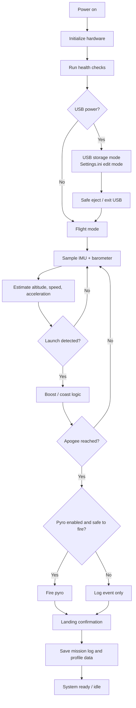

# AstroNav Nano Firmware Documentation

## IMPORTANT DISCLAIMER - READ FIRST

This product and software are only intended to be used exactly as documented by AstroNav.

Any use outside of intended operation, testing process, electrical limits, legal regulations, launch rules, or safety procedures is strictly at your own risk.

By building, flashing, testing, powering, wiring, arming, or operating this firmware and hardware, you accept full responsibility for all outcomes.

You are 100% responsible for safe use, legal compliance, damage prevention, and risk control.

The author/maintainer assumes zero liability for:

- injury, death, fire, explosion, or other physical harm
- property damage or equipment loss
- data loss, mission loss, or business loss
- legal, regulatory, insurance, or certification consequences
- misuse, wiring mistakes, assembly defects, or unsafe test setups

If you do not fully understand and accept these terms, do not use this product or software.

By using this device, building this firmware, or compiling this code, you acknowledge that you have read and understood this documentation, the fair warnings in this project, and the applicable YoupSpace legal terms.

You agree to the following:

- you have read the full documentation for this project before use
- you accept the safety warnings and risk disclosures
- you accept the YoupSpace Terms and Conditions
- you accept the YoupSpace Privacy Policy

Relevant links:

- https://youpspace.com/terms-and-conditions/
- https://youpspace.com/privacy-policy/

## Who this guide is for

This guide is written for someone who is new to this kind of hardware and firmware work, but is willing to follow a careful setup process.

It assumes you are comfortable with:

- basic Windows usage
- installing software
- opening a project in VS Code
- connecting a USB device to a PC
- editing a text file such as Settings.ini

This is not a plug-and-play consumer product. It is a technical flight-control project that must be treated with respect and safety-first thinking.

## Quick chapter guide

1. Safety first and project expectations
2. Required tools and software setup
3. Building the firmware
4. Uploading to the board
5. First boot and USB configuration
6. Editing settings and understanding the config file
7. Production metadata and optional serial/key handling
8. Flight logic and state behavior
9. Troubleshooting and common issues

## Safety-first notes for beginners

Before you build, flash, or launch anything:

- double-check your wiring and power source
- do not connect pyro or launch hardware until the board is verified
- do not treat the firmware as a safe-to-fly system without a proper test plan
- if you are unsure what a setting does, do not change it blindly
- use USB mode to edit configuration before flight testing

This project includes real flight logic, output control, and safety-critical behavior. Treat every change seriously.

## IDE setup (VS Code + PlatformIO)

### 1) Install PlatformIO

In VS Code:

- open the Extensions view
- install the PlatformIO IDE extension
- reload VS Code after installation

### 2) Open the project folder

Open the repository folder in VS Code, then let PlatformIO detect the project.

### 3) Build the firmware

Use either the PlatformIO sidebar build button or:

```powershell
pio run
```

### 4) Upload to the board

```powershell
pio run --target upload --upload-port COM3
```

Replace COM3 with your board's actual COM port.

### 5) Monitor serial output

```powershell
pio device monitor
```

### 6) Common Windows dependency issue

If PlatformIO reports missing Git while resolving dependencies, install Git and ensure this path is on PATH:

```text
C:\Program Files\Git\cmd
```

Then reload VS Code and build again.

### 7) Production/build metadata (optional)

This project includes an automatic build script, [generate_version.py](generate_version.py), which creates the header file in [include/build_info.h](include/build_info.h). That header contains the build version, firmware metadata, and a warranty signature.

For production builds, the script can optionally use a local secrets folder:

```text
C:\Users\<your-user>\Documents\GitHub\YoupSpace_Secrets\
```

Files used when present:

- warranty_key.txt
- serial_registry.csv

Behavior:

- If the secret key is present and valid, the firmware generates an official warranty signature.
- If the secret key is missing, the build still completes and logs a yellow warning, using a dummy signature instead.
- If the serial registry CSV exists, the script can track or reserve a serial number for production uploads.
- If the CSV is missing, the build still completes and logs a yellow warning; no serial registry enforcement is applied.

This is intentionally safe for local or open-source builds: the production keys are not required for compilation, but they are used when available for real manufacturing and validation flows.

## Basic how-it-works summary

At a high level, this firmware does four things:

- checks hardware health at boot
- determines power source and enters the proper mode
- runs a flight state machine (launch, coast, pyro, landing, fault)
- logs mission data for later review

Power behavior:

- on USB power, the board can enter USB storage mode for settings/configuration
- in flight mode, the board samples sensors and updates state continuously

Pyro behavior:

- normal pyro firing is controlled by apogee logic and settings
- a test-only serial command (PYROTEST) exists and is intentionally dangerous

Companion software note:

This firmware is intended to work with AstroNav MC, the mission-control software used to configure the device, review logs, and simulate flight data. When the board is connected, the firmware exposes USB storage and settings files so the mission-control software can read, edit, and inspect the configuration and saved flight logs.

The AstroNav MC workflow is designed to let users:

- connect the device over USB
- edit the live settings with an easy interface
- read out saved log files
- inspect previous flights and summary data
- simulate and validate mission behavior in a more user-friendly environment

The PC companion software is separate from this firmware repository and is intended to complement the board rather than replace the onboard logic.

## Firmware overview: what happens first

The firmware follows a simple startup and mission flow.

1. Boot the board and initialize low-level hardware.
2. Check core health, memory, SPI bus, IMU, barometer, and flash.
3. Measure VIN and determine whether the board is powered from USB or battery.
4. If on USB, expose the drive and allow settings editing.
5. If not on USB, start the normal flight runtime loop.
6. Sample sensors and estimate altitude, speed, acceleration, and state.
7. Detect launch, boost, coast, apogee, and landing.
8. Trigger pyro only when the logic and safety settings allow it.
9. Keep logging the raw data and summary values.
10. Save the mission log and persist device profile data when the flight ends.



This is the big picture: the firmware is not doing random calculations. It boots, validates itself, decides whether it is in USB config mode or flight mode, samples the rocket dynamics, and then moves through guided mission states with logging and safety checks all the way through.

## Detailed explanation

### Overview

This firmware is the flight and safety controller for the AstroNav Nano board. Its purpose is to:

- detect board health at boot
- initialize the IMU and barometer
- classify the power source
- enter USB mass-storage mode only when USB power is present
- allow USB tuning of selected flight parameters
- detect launch, apogee, pyro firing, landing, and fault states
- continuously log as much sensor and state information as practical

The firmware is designed for reliability and safe behavior under real flight conditions while keeping configuration simple and user-accessible over USB.

### Power and USB behavior

#### USB power detection

The board checks voltage on the VIN sense input before deciding whether it is running on USB power or battery power.

- USB range: 4.5 V to 5.5 V
- 1S LiPo: 3.0 V to 4.35 V
- 2S LiPo: 6.0 V to 8.4 V
- anything else: Unknown

The board only enters USB mass-storage mode when USB power is detected.

#### USB ejection exit behavior

When the device is in USB mode and the host safely ejects or disconnects the drive, the firmware sets a USB exit request and transitions into flight mode.

### Flight state machine

The firmware uses the following states:

- Booting
- Calibrating
- Idle
- UsbMode
- Armed
- Boost
- Coast
- PyroFired
- Landed
- Fault

The state transitions are intentionally limited so that only valid transitions occur. A bad transition is treated as a warning and may be logged as a fault condition.

#### State description

- Booting: startup health checks and low-level initialization
- Calibrating: IMU and barometer establish a stable reference frame
- Idle: board is ready for launch and waiting for trigger conditions
- UsbMode: USB drive is active and settings can be edited
- Boost: launch acceleration detected and flight is ascending
- Coast: acceleration dropped, flight still active without boost thrust
- PyroFired: apogee detection triggered pyro output
- Landed: landing confirmed from stable ground conditions
- Fault: critical fault, red blinking LED, system latched safe

### Launch, apogee, and landing detection

Flight state changes are evaluated every sensor sample. The loop runs at 100 ms (about 10 samples per second).

#### Launch detection

The board watches for sustained acceleration above launch threshold.

- launch threshold parameter: LAUNCH_THRESHOLD_G
- default value: 1.35

Launch detection uses IMU first. If IMU is not trustworthy, the firmware falls back to altitude and velocity trends.

#### Apogee detection

During boost/coast, the code checks for:

- altitude drop from peak
- downward velocity below threshold
- low acceleration condition
- minimum flight time requirement

When criteria are met and enabled, the pyro channel can fire.

#### Landing detection

After pyro event, landing confirmation checks that craft has settled.

The system combines:

- low altitude trend
- low vertical velocity
- low acceleration
- gravity alignment checks when available

This is intentionally conservative and requires sustained confirmation.

### Sensor fallback logic

The firmware is designed to continue safely using healthy sensor paths when one source degrades.

#### IMU priority

The IMU is used for:

- launch detection
- orientation estimation
- acceleration magnitude
- gravity direction estimation

#### Barometer priority

The barometer is used for:

- altitude estimation
- vertical velocity estimation
- apogee and landing confirmation

#### Fallback behavior

When one sensor is noisy, stale, or invalid:

- remaining valid sensors continue to drive state logic
- non-critical sensor faults do not force immediate fault state
- warning/fault handling still protects outputs

### Logging strategy

The firmware logs mission data continuously for post-flight analysis.

#### Mission log format

CSV log fields include:

- counter
- time in ms
- state
- power mode
- pyro flag
- acceleration axes
- gyro axes
- temperature
- pressure
- altitude
- vertical velocity
- roll and pitch
- health bits

#### Logging cadence

Default sample period is 100 ms (about 10 Hz), balancing:

- data richness
- flash capacity
- response latency
- low runtime overhead

### USB settings

Current user-editable settings:

- ESTIMATED_HEIGHT_M
- HEIGHT_MARGIN_M
- ESTIMATED_SPEED_MPS
- SPEED_MARGIN_MPS
- LAUNCH_THRESHOLD_G
- FIRE_PYRO_APOGEE

#### FIRE_PYRO_APOGEE

Boolean behavior:

- TRUE: apogee detection can fire pyro output
- FALSE: apogee is still detected/logged, but no pyro pulse is fired

### Test-only serial pyro command (danger)

WARNING: This command can energize the pyro output and can cause ignition if hardware is connected. Misuse can lead to fire, injury, equipment loss, or legal/safety violations.

For controlled test work only:

- command: PYROTEST
- behavior: send PYROTEST twice
- confirmation window: second command must arrive within 5 seconds
- mode restriction: accepted only in flight states (Idle/Armed/Boost/Coast/PyroFired/Landed), never in USB storage mode
- pulse safety limit: pyro output auto-disables after 1 second

If confirmation is not completed in time, you must start again.

### Fault handling and LED behavior

Faults are high-priority:

- fault state is latched
- pyro output is disabled safely
- status LED turns red
- red LED blinks rapidly for critical attention

### Safety principles

Design priorities:

1. Safe default behavior
2. No unsafe state transitions
3. Use every healthy sensor source
4. Log major events and state changes
5. Keep the user-facing interface simple
6. Never hide real fault conditions

## Documentation note

The current source files remain the source of truth for behavior. This README describes intended operation and safety context for integration and review.
